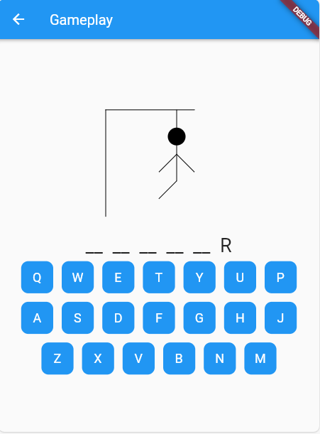
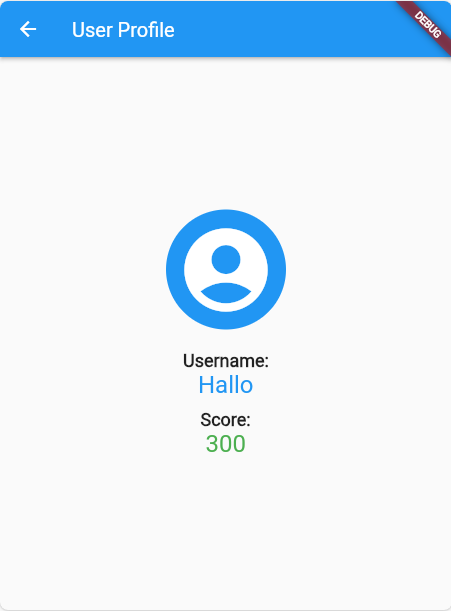

# Hangman Flutter App

Welcome to the Hangman Flutter App! This is a fun and interactive mobile game built using the Flutter framework. The app features a classic hangman game where users can guess movie names and earn scores based on their performance.

## Features

- **User Authentication:** Register and log in to track your scores and progress.
- **Gameplay:** Guess movie names letter by letter, and see how many you can get right!
- **Scoreboard:** Compete with other users and check your rank on the leaderboard.

## Getting Started

1. Clone the repository: `git clone https://github.com/Alston16/HangMan.git`
2. Navigate to the project folder: `cd HangMan`
3. Install dependencies: `flutter pub get`
4. Run the app: `flutter run`

## Screenshots

---

Feel free to customize it based on your project's specific details!
